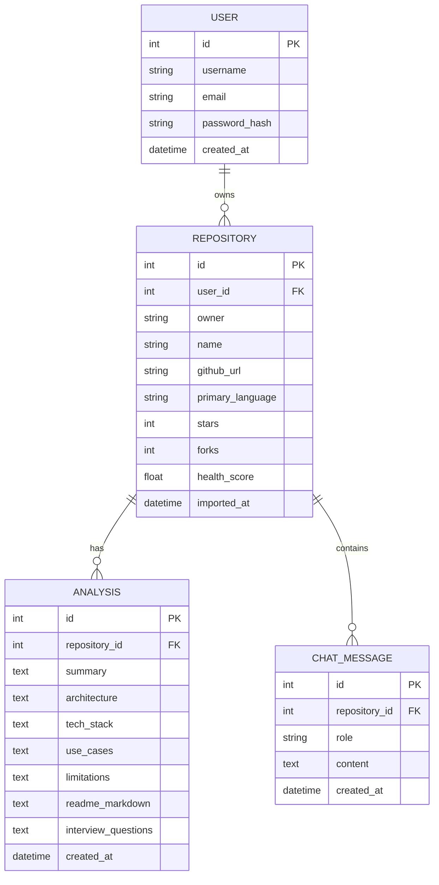

# RepoIQ — AI-Powered Codebase Intelligence & Health Analytics

<div align="center">


**An intelligent full-stack developer platform that turns unfamiliar GitHub repositories into structured, actionable architectural insights, deterministic health scores, automated documentation, interview questions, and context-aware conversational chat.**

[Features](#-feature-breakdown) • [Architecture](#-architecture--design) • [Quick Start](#-getting-started) • [Environment Variables](#-environment-variables) • [API Reference](#-api-reference)

</div>

---

## 📌 Overview

Exploring a new codebase usually requires hours of manually inspecting directories, evaluating README completeness, deciphering architectures, and determining maintenance quality.

**RepoIQ** solves this by providing an end-to-end on-ramp to any public GitHub repository:

1. **Deterministic Quality Signals**: Calculates a transparent, non-AI health score (0–100) based on 10 concrete repository signals (CI workflows, test suites, licenses, recent commits, topics, and documentation).
2. **High-Speed AI Code Analysis**: Integrates **Groq Cloud API** (`llama-3.3-70b-versatile`) for ultra-low latency inference to extract architecture summaries, tech stack breakdowns, use cases, and limitations.
3. **Automated Documentation**: Generates comprehensive, production-ready Markdown README files.
4. **Targeted Interview Questions**: Generates 6 repo-specific interview questions graded by difficulty (Easy, Medium, Hard) and categorized by engineering topics.
5. **Persistent Repository Chat**: Enables grounded conversational exploration of any imported repository with persistent conversation history stored in the database.


---

## 🚀 Feature Breakdown

### 1. Authentication & Security (JWT + BCrypt)

- **Registration & Login**: Secure account creation with email/username uniqueness checks and salted bcrypt password hashing.
- **Stateless JWT Tokens**: Issues 60-minute signed access tokens (`HS256`).
- **Frontend Interceptor**: Axios automatically injects the Bearer token into outgoing requests.
- **Protected Routes**: React Router `PrivateRoute` wrapper guarantees unauthenticated users cannot access workspace routes.


### 2. Live GitHub Repository Ingestion

- Accepts any public `github.com/owner/repo` URL.
- Validates the link structure and fetches live metadata (stargazers, forks, default branch, primary language, topics, license, open issues) directly from the GitHub REST API.
- Prevents duplicate repository imports per user account.

### 3. Dynamic Analytics Dashboard

- **Workspace Health Metrics**: Displays total repositories, analyzed repositories count, and average health score computed from real database records.
- **Language Distribution**: Dynamic pie chart and percentage breakdown aggregating tracked languages across the workspace.
- **Activity & Health Timeline**: Trend area chart illustrating repository growth and median health.
- **Repository List**: Interactive cards showing stars, forks, primary language, and health rings with direct navigation.

### 4. Deterministic 10-Point Health Engine

A transparent, non-AI scoring algorithm evaluating real repository signals:

| Signal Check            | Weight | Evaluation Criteria                                                                         |
| :---------------------- | :----- | :------------------------------------------------------------------------------------------ |
| **README**              | 15%    | README file exists on default branch                                                        |
| **Test Suite**          | 15%    | Presence of test folders (`test`, `spec`) or configs (`pytest.ini`, `jest.config.js`, etc.) |
| **Recent Activity**     | 15%    | Commits recorded within the past 30 days                                                    |
| **License**             | 10%    | Valid open-source license declared                                                          |
| **Description**         | 10%    | Repository description provided                                                             |
| **Topics**              | 10%    | Repository discoverability tags populated                                                   |
| **CI / GitHub Actions** | 10%    | `.github/workflows` automation present                                                      |
| **Issues Enabled**      | 5%     | GitHub Issues feature enabled                                                               |
| **Wiki Enabled**        | 5%     | GitHub Wiki feature enabled                                                                 |
| **Default Branch**      | 5%     | Default branch standard (`main` / `master`)                                                 |

### 5. AI Architectural Summary (Groq API)

- Retrieves the repository's README, constructs a structured prompt, and queries Groq's high-speed inference engine.
- Returns five structured fields stored in the database:
  - `summary`: High-level purpose and functionality.
  - `architecture`: Codebase structure and design patterns.
  - `tech_stack`: Languages, frameworks, and libraries.
  - `use_cases`: Target audiences and applications.
  - `limitations`: Identified gaps or architectural trade-offs.

### 6. AI README Generator

- Synthesizes repository context and metadata into a comprehensive, ready-to-use Markdown README with feature lists, tech stack badges, installation commands, and usage guidelines.

### 7. Targeted Interview Question Generator

- Crafts 6 repo-specific technical interview questions (2 Easy, 2 Medium, 2 Hard) tagged with architectural domains (e.g. _System Design_, _Scalability_, _Trade-offs_, _Error Handling_).

### 8. Context-Aware AI Chat with History Persistence

- Interactive chat panel tied to individual repositories.
- Grounded in the repository's metadata, README, and AI analysis.
- Stores all user prompts and assistant replies in the database (reloading conversation history seamlessly on page refresh).
- Supports URL deep-linking (`/chat?repoId=123`) and responsive repository switching on desktop, tablet, and mobile.

### 9. Dynamic Improvement Suggestions

- Generates actionable recommendations dynamically derived from failing health checks and AI limitations.

---


## 🏗 Architecture & Design

### Layered Backend (FastAPI)

```
backend/app/
├── routers/          # HTTP layer: Request validation, status codes, route declarations
│   ├── auth.py
│   ├── repository.py
│   ├── chat.py
│   └── health.py
├── services/         # Business logic layer: External APIs, scoring algorithms, Groq LLM
│   ├── auth_service.py
│   ├── github_service.py
│   ├── analysis_service.py
│   └── chat_service.py
├── repositories/     # Data access layer: Direct SQLAlchemy database queries
│   ├── user_repository.py
│   ├── repository_repository.py
│   ├── analysis_repository.py
│   └── chat_repository.py
├── models/           # SQLAlchemy ORM database models
│   ├── user.py
│   ├── repository.py
│   ├── analysis.py
│   └── chat_message.py
├── schemas/          # Pydantic validation models (Request / Response DTOs)
└── utils/            # JWT token helpers, bcrypt password hashing
```

### Database Entity Relationship



---

## 🛠 Tech Stack

| Domain           | Technologies                                                                                       |
| :--------------- | :------------------------------------------------------------------------------------------------- |
| **Frontend**     | React 18, TypeScript, Vite, Tailwind CSS, Shadcn UI, Recharts, Lucide Icons, Axios, React Router 6 |
| **Backend**      | Python 3.11+, FastAPI, SQLAlchemy 2.0, Alembic, Pydantic v2, Python-JOSE, BCrypt, Uvicorn          |
| **AI Inference** | Groq Cloud SDK (`llama-3.3-70b-versatile` / `llama-3.1-8b-instant`)                                |
| **Database**     | PostgreSQL (Production) / SQLite (Local Development)                                               |
| **Testing**      | Pytest, FastAPI TestClient, Httpx                                                                  |
| **Deployment**   | Vercel (Frontend), Render (Backend & PostgreSQL), 100% Free-Tier Compatible                        |

---

## 💻 Getting Started

### Prerequisites

- **Node.js**: v18.0 or higher
- **Python**: v3.11 or higher
- **Git**
- **Groq API Key**: (Free tier key available at [console.groq.com](https://console.groq.com))

---

### 1. Clone the Repository

```bash
git clone https://github.com/mansaakohli15/repoiq-insight.git
cd repoiq-insight
```

---

### 2. Backend Setup

```bash
cd backend

# Create and activate virtual environment
python -m venv .venv
# On Windows PowerShell:
.\.venv\Scripts\Activate.ps1
# On macOS / Linux:
# source .venv/bin/activate

# Install dependencies
pip install -r requirements.txt

# Create .env file
copy .env.example .env   # Windows
# cp .env.example .env   # macOS/Linux
```

Configure `backend/.env`:

```env
DATABASE_URL=sqlite:///./repoiq.db
JWT_SECRET_KEY=your-super-secret-jwt-key
JWT_ALGORITHM=HS256
JWT_ACCESS_TOKEN_EXPIRE_MINUTES=60
GROQ_API_KEY=gsk_your_groq_api_key_here
GROQ_MODEL=llama-3.3-70b-versatile
CORS_ORIGINS=http://localhost:5173,http://localhost:3000,http://127.0.0.1:5173
```

Start the FastAPI backend server:

```bash
uvicorn app.main:app --reload --port 8000
```

API Documentation will be available at [http://localhost:8000/docs](http://localhost:8000/docs).

---

### 3. Frontend Setup

In a new terminal window from the project root:

```bash
# Install frontend dependencies
npm install

# Create frontend .env file
# Windows:
copy .env.example .env
# macOS/Linux:
# cp .env.example .env
```

Ensure `.env` contains:

```env
VITE_API_URL=http://localhost:8000
```

Start the Vite development server:

```bash
npm run dev
```

Open [http://localhost:5173](http://localhost:5173) in your browser.

---

## 🧪 Automated Testing

### Backend Unit & Integration Tests

Run the comprehensive pytest suite:

```bash
cd backend
pytest -v
```

### Frontend Typecheck & Build

```bash
npm run build
```

---

## 🔑 Environment Variables

### Frontend (`/.env`)

| Variable       | Required | Default                 | Description     |
| :------------- | :------: | :---------------------- | :-------------- |
| `VITE_API_URL` |    No    | `http://localhost:8000` | Backend API URL |

### Backend (`/backend/.env`)

| Variable                          |   Required   | Default                          | Description                           |
| :-------------------------------- | :----------: | :------------------------------- | :------------------------------------ |
| `DATABASE_URL`                    |      No      | `sqlite:///./repoiq.db`          | SQLAlchemy database connection string |
| `JWT_SECRET_KEY`                  |     Yes      | `change-this-development-secret` | Secret key for JWT signatures         |
| `JWT_ALGORITHM`                   |      No      | `HS256`                          | JWT signing algorithm                 |
| `JWT_ACCESS_TOKEN_EXPIRE_MINUTES` |      No      | `60`                             | Token expiration time in minutes      |
| `GROQ_API_KEY`                    | Yes (for AI) | `""`                             | Groq API Key for LLM features         |
| `GROQ_MODEL`                      |      No      | `llama-3.3-70b-versatile`        | Groq LLM model name                   |
| `CORS_ORIGINS`                    |      No      | `http://localhost:5173...`       | Comma-separated allowed CORS origins  |

---

## 📡 API Reference

### Authentication

- `POST /auth/register` — Register a new user account
- `POST /auth/login` — Authenticate and receive a JWT token
- `GET /auth/profile` — Fetch the current authenticated user profile

### Repositories

- `GET /repositories` — List all repositories imported by the user
- `POST /repositories/import` — Validate and import a public GitHub repository
- `GET /repositories/{id}` — Get details and metadata for a repository
- `POST /repositories/{id}/health-score` — Execute the deterministic 10-point health score check

### AI Analysis (Groq)

- `POST /repositories/{id}/analyze` — Generate AI summary, architecture, tech stack, and limitations
- `GET /repositories/{id}/analysis` — Retrieve the latest generated AI analysis
- `POST /repositories/{id}/readme` — Generate a full Markdown README
- `POST /repositories/{id}/interview-questions` — Generate 6 targeted technical interview questions

### Repository Chat

- `GET /repositories/{id}/chat` — Retrieve conversation history for a repository
- `POST /repositories/{id}/chat` — Send a prompt and receive a grounded Groq AI response

---

## 🌐 Free-Tier Deployment Guide

- **Frontend on Vercel**: Connect GitHub repository, set Root Directory to `./`, and configure `VITE_API_URL` environment variable pointing to your backend. The included `vercel.json` ensures client-side routes rewrite to `index.html`.
- **Backend on Render**: Create a Web Service pointing to `backend/`, specify Build Command `pip install -r requirements.txt` and Start Command `uvicorn app.main:app --host 0.0.0.0 --port $PORT`. Configure environment variables (`DATABASE_URL`, `JWT_SECRET_KEY`, `GROQ_API_KEY`, `CORS_ORIGINS`).
- **Database on Render**: Provision a free Managed PostgreSQL database and copy the Internal Database URL into your Web Service's `DATABASE_URL`.

---

## 📄 License

This project is open-source and available under the [MIT License](LICENSE).
